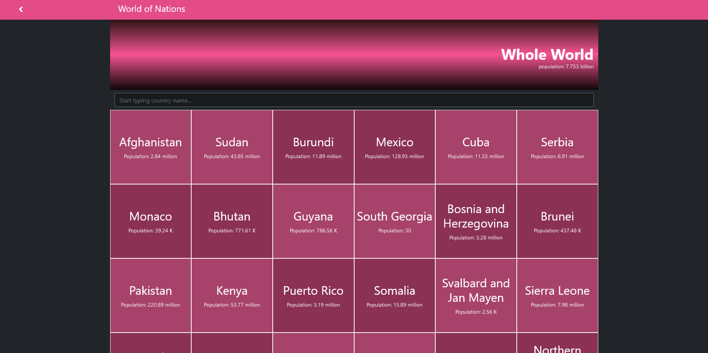
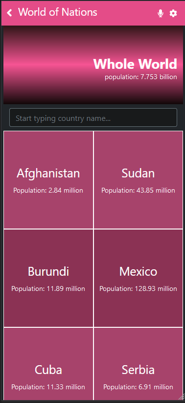
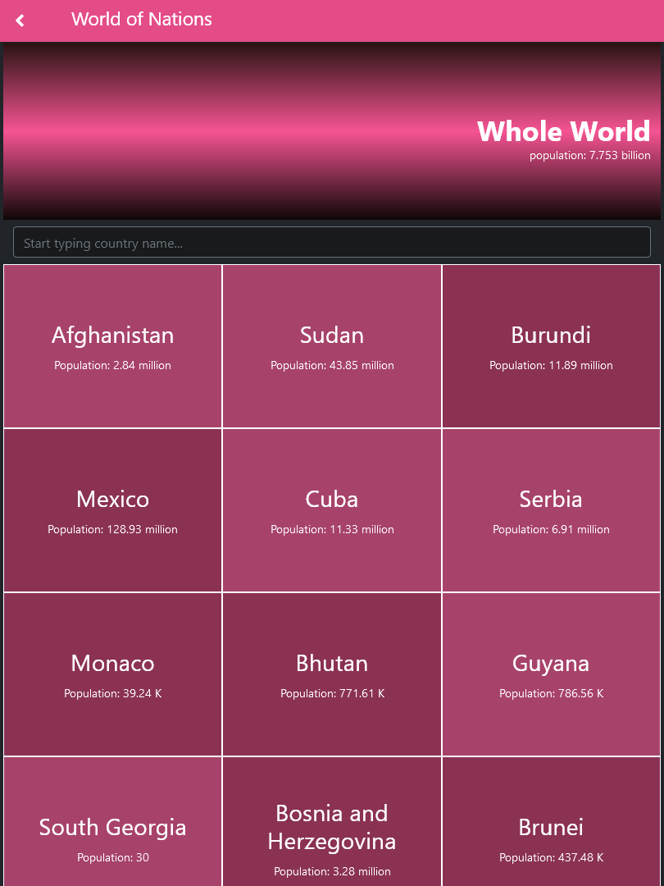

[![Contributors][contributors-shield]][contributors-url]
[![Forks][forks-shield]][forks-url]
[![Stargazers][stars-shield]][stars-url]
[![Issues][issues-shield]][issues-url]

<!-- PROJECT LOGO -->

 

  

  <h2 align="center">World of Nations</h2>

  <h3 align="center"> React, Redux, Javascript, Webpack, get from and save to API --> world-of-nations<h3>
  

    <a href="#table-of-contents"><strong>Explore the docs »</strong></a>
     
     
    -
    <a href="https://github.com/Meltrust/world-of-nations/issues">Report a Bug</a>
    -
    <a href="https://github.com/Meltrust/world-of-nations/issues">Request a Feature</a>
    -
  

<!-- TABLE OF CONTENTS -->

## Table of Contents

- [About](#about)

  - [Desktop view](#desktop-view)
    - [Homepage](#homepage)
  - [Small devices view](#small-devices-view)
    - [Homepage phone](#homepage-phone)
  - [Tablets view](#tablets-view)
    - [Homepage tablets](#homepage-tablets)
  - [Demo](#demo)
  - [Features Video](#features-video)
  - [Made with](#made-with)
  - [Future updates and roadmap](#future-updates-and-roadmap)
  - [Getting started](#getting-started)
 
- [Author](#author)
- [Contributing](#contributing)
- [Show your support](#show-your-support)
- [Acknowledgments](#acknowledgments)
- [License](#license)

  
## About

World of nations is a beautiful, totally responsive web app made with React and Redux where you can consult a list of metrics and info about the countries of the world, achieved by fetching the [REST countries](https://restcountries.com/) API with a beautiful frontend mosaic design. You can search by country name and the results will come up as you type. By clicking on any country, you can view its info. 
  
 
  
## Desktop view  
  
### Homepage

  

  
  
 

  
## Small devices view
  
### Homepage phone
  

     

  
## Tablets view
  
### Homepage tablets
  

     

  

## Features video

https://www.loom.com/share/94307a4dd903485cb31a063b0efe72a6

## Demo

[Visit World of Nations!](https://meltrust.github.io/world-of-nations/) 

## Made with

- Javascript ✔️
- Webpack ✔️
- React ✔️
- Redux ✔️
- Twitter Bootstrap ✔️
- CSS3 ✔️
- HTML5 ✔️

## Future Updates and Roadmap

- More general styling
- Categorization
- Covid-19 live data (extra API)

## Getting Started

To get a local copy up and running follow these simple example steps:

1. Under the repository name, click the Clone or download green button.

 

  
 

2. Copy the URL given by clicking the clipboard button

3. Open a terminal window in your local machine and change the current directory to the one you want the clone directory to be made.

4. Type  git clone and then paste the URL you previusly copied to the clipboard

5. Change the current directory to the newly created folder

6. In your terminal, `npm install` to install the dependencies.

8. Now run `npm start` and the app should appear on your browser.

## Author

👤 **Miguel Tapia**

- Github: [@meltrust](https://github.com/meltrust)
- Linkedin: [linkedin](https://www.linkedin.com/in/meltrust/)
- Or talk to me directly at: original.mtapia@outlook.com
  
## Contributing

🤝 Contributions, issues and feature requests are welcome!

Feel free to check the [issues page](issues/).

## Show your support

Give a ⭐️ if you like this project!

## Acknowledgments

- Hat tip to anyone whose code was used
- Inspiration
- etc

## License

📝 This project is [MIT](lic.url) licensed.

<!-- MARKDOWN LINKS & IMAGES -->
<!-- https://www.markdownguide.org/basic-syntax/#reference-style-links -->

[contributors-shield]: https://img.shields.io/github/contributors/Meltrust/world-of-nations.svg?style=flat-square
[contributors-url]: https://github.com/Meltrust/world-of-nations/graphs/contributors
[forks-shield]: https://img.shields.io/github/forks/Meltrust/world-of-nations
[forks-url]: https://github.com/Meltrust/world-of-nations/network/members
[stars-shield]: https://img.shields.io/github/stars/Meltrust/world-of-nations
[stars-url]: https://github.com/Meltrust/world-of-nations/stargazers
[issues-shield]: https://img.shields.io/github/issues/Meltrust/world-of-nations.svg?style=flat-square
[issues-url]: https://github.com/Meltrust/world-of-nations/issues
